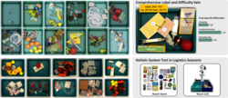
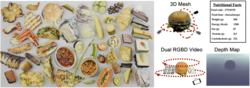
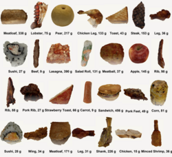

## Datasets

### MetaGraspNet

A comprehensive dataset for robotic grasping and manipulation research.  
[View on GitHub](https://github.com/maximiliangilles/MetaGraspNet?tab=readme-ov-file)

### MetaFood3D Dataset

A large-scale dataset for 3D food analysis and understanding.  
[Access Dataset](https://lorenz.ecn.purdue.edu/~food3d/)

### NutritionVerse 3D

A comprehensive dataset for nutritional analysis of food items in 3D.  
[View on Kaggle](https://www.kaggle.com/datasets/amytai/nutritionverse-3d)

## 2025

1. F. Wu and Y. Chen, "FruitNinja: 3D Object Interior Texture Generation with Gaussian Splatting," in Proceedings of the IEEE/CVF Conference on Computer Vision and Pattern Recognition (CVPR), 2025.

2. S. Viswanath, K. Shah, P. Xi, A. Wong, and Y. Chen, "FoodVideoQA: A Novel Baseline Framework for Dietary Monitoring," in MetaFood Workshop at CVPR 2025.

3. J. Li, F. J. Pena Cantu, E. Yu, A. Wong, Y. Cui, and Y. Chen, "SAMJAM: Zero-Shot Video Scene Graph Generation for Egocentric Kitchen Videos," in MetaFood Workshop at CVPR 2025.

4. J. Valdes, S. Liu, S. Yang, Y. Chen, A. Wong, and P. Xi, "Food Degradation Analysis Using Multimodal Fuzzy Clustering," in MetaFood Workshop at CVPR 2025.

5. D. Khanna, J. Bright, Y. Chen, and J. Zelek, "SportMamba: Adaptive Non-Linear Multi-Object Tracking with State Space Models for Team Sports," in CVSports Workshop at CVPR 2025.

6. L. Salass, J. Bright, A. Nazemi, Y. Chen, J. Zelek, and D. Clausi, "Ice Hockey Puck Localization Using Contextual Cues," in CVSports Workshop at CVPR 2025.

7. J. Bright, Z. Wang, Y. Chen, S. Rambhatla, D. A. Clausi, and J. S. Zelek, "Gen4D: Synthesizing Humans and Scenes in the Wild," in Computer Vision in the Wild Workshop at CVPR 2025.

## Abstracts (2025)
1. E. Wang and Y. Chen, "FoodTrack: Estimating Handheld Food Portions with Egocentric Video," in MetaFood Workshop at CVPR 2025.

2. Y. H. Lee and Y. Chen, "Dietary Intake Estimation via Continuous 3D Reconstruction of Food," in MetaFood Workshop at CVPR 2025.

3. K. Tan, F. Yang, and Y. Chen, "6D Pose Estimation on Spoons and Hands," in MetaFood Workshop at CVPR 2025.

4. K. Buzko, D. Clausi, and Y. Chen, "Generative Video Editing: From Unconfident to Confident," in Women in Computer Vision Workshop at CVPR 2025.

5. K. Buzko, D. Clausi, and Y. Chen, "HAIKYU: Hockey Action Identification and Keypose Understanding," in Women in Computer Vision Workshop at CVPR 2025.

6. M. Q. Ali, S. Nair, A. Wong, Y. Cui, and Y. Chen, "GraphPad: Inference-Time 3D Scene Graph Updates for Embodied Question Answering," in 3D-LLM/VLA Workshop at CVPR 2025.

## 2024

1. B. Balaji, J. Bright, Y. Chen, S. Rambhatla, J. S. Zelek, and D. A. Clausi, "Seeing Beyond the Crop: Using Language Priors for Out-of-Bounding Box Keypoint Prediction," in Advances in Neural Information Processing Systems, 2024, pp. 102897--102918.

2. D. Mao, Y. Chen, Y. Wu, M. Gilles, and A. Wong, "Rethinking resource competition in multi-task learning: From shared parameters to shared representation," IEEE Access, pp. 1–1, 2024. doi: 10.1109/ACCESS.2024.3429281.

3. X. Ni, P. W. Fieguth, Z. Ma, B. Shi, Y. Qiu, Y. Chen, and H. Liu, "Superpixel-guided multi-type rail segmentation via contextual information aggregation," IEEE Transactions on Intelligent Transportation Systems, pp. 1–15, 2024. doi: 10.1109/TITS.2024.3397509.

4. B. Balaji, J. Bright, S. Rambhatla, Y. Chen, A. Wong, J. S. Zelek, and D. A. Clausi, "Domain-guided Masked Autoencoders for Unique Player Identification," in Proceedings of the Conference on Robots and Vision, https://crv.pubpub.org/pub/4ekemco5, May 2024.

5. J. Bright, B. Balaji, Y. Chen, D. A Clausi, and J. S. Zelek, "Pitchernet: Powering the moneyball evolution in baseball video analytics," in Proceedings of the IEEE/CVF Conference on Computer Vision and Pattern Recognition (CVPR) Workshops, Jun. 2024, pp. 3420–3429.

6. J. Bright, B. Balaji, H. Prakash, Y. Chen, D. A. Clausi, and J. S. Zelek, "Distribution and Depth-Aware Transformers for 3d Human Mesh Recovery," in Proceedings of the Conference on Robots and Vision, https://crv.pubpub.org/pub/f9hwdv89, May 2024.

7. V. Chomko, Y. Chen, D. Clausi, and A. Wong, "Synthetic local data augmentation," in Proceedings of IEEE 26th International Workshop on Multimedia Signal Processing (MMSP), West Lafayette, Indiana, USA, Oct. 2024.

8. Y. Huang, Y. Chen, and J. Zelek, "Zero-shot monocular motion segmentation in the wild by combining deep learning with geometric motion model fusion," in Proceedings of the IEEE/CVF Conference on Computer Vision and Pattern Recognition (CVPR) Workshops, 2024, pp. 2733–2743.

9. M. Patel, X. Chen, L. Xu, Y. Chen, K. A. Scott, and D. A. Clausi, "Region-level labels in ice charts can produce pixel-level segmentation for sea ice types," in Proceedings of 2nd Machine Learning for Remote Sensing (ML4RS) Workshop at ICLR 2024, Vienna, Austria, May 2024.

10. H. Prakash, J. C. Shang, K. M. Nsiempba, Y. Chen, D. A. Clausi, and J. S. Zelek, "Multi Player Tracking in Ice Hockey with Homographic Projections," in Proceedings of the Conference on Robots and Vision, https://crv.pubpub.org/pub/v4f6w2f7, May 2024.

11. A. Sharma, C. Czarnecki, Y. Chen, P. Xi, L. Xu, and A. Wong, "How much you ate? food portion estimation on spoons," in Proceedings of the IEEE/CVF Conference on Computer Vision and Pattern Recognition (CVPR) Workshops, Jun. 2024, pp. 3761–3770.

## Abstracts (2024)

1. M. Keller, C.-e. A. Tai, Y. Chen, P. Xi, and A. Wong, "Nutritionverse-direct: Exploring deep neural networks for multitask nutrition prediction from food images," MetaFood Workshop, CVPR, 2024. url: https://arxiv.org/abs/2405.07814.

2. A. Pathiranage, C. Czarnecki, Y. Chen, P. Xi, L. Xu, and A. Wong, "In the wild ellipse parameter estimation for circular dining plates and bowls," MetaFood Workshop, CVPR, 2024. url: https://arxiv.org/abs/2405.07121.

3. E. Z. Zeng, Y. Chen, and A. Wong, "Understanding the limitations of diffusion concept algebra through food," MetaFood Workshop, CVPR, 2024. url: https://arxiv.org/abs/2406.03582.
