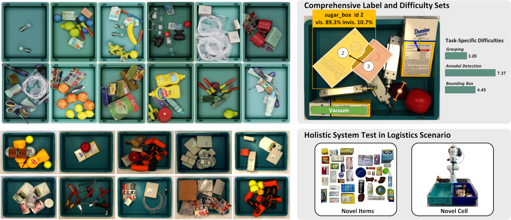
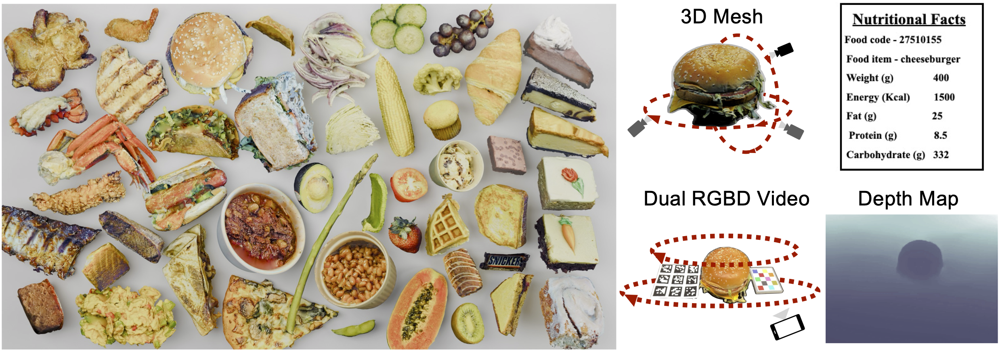
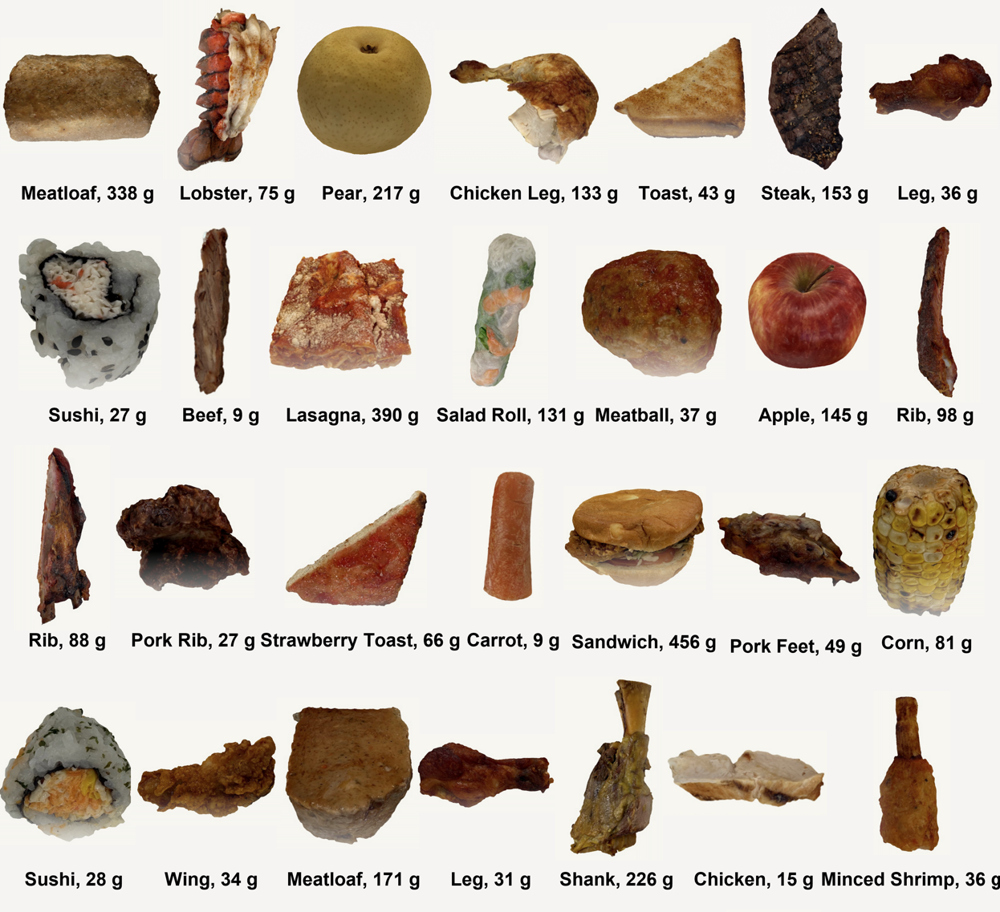

# About Me
[Google Scholar](https://scholar.google.ca/citations?user=NwxXuCYAAAAJ&hl=en) | [Linkedin](https://www.linkedin.com/in/yuhao-chen-789a2164/)

I am a Research Assistant Professor at the [Vision and Image Processing Lab (VIP)](https://vip.uwaterloo.ca/) at the University of Waterloo, specializing in Computer Vision. I joined the VIP lab as a postdoctoral fellow from 2020 to 2022, was promoted to Research Associate in 2022, and became a Research Assistant Professor in 2023. I earned my B.A.Sc. and Ph.D. degrees in Electrical and Computer Engineering from Purdue University in 2015 and 2019, respectively, where I was a member of the [Video and Image Processing (VIPER) laboratory](https://engineering.purdue.edu/~ips/), under the supervision of [Professor Edward J. Delp](https://engineering.purdue.edu/~ace/). 

My primary research focuses on developing advanced CV algorithms for analyzing food, including their shapes and nutritional content. **My ultimate vision is to empower individuals to create their own games and movies through accessible, powerful CV algorithms.** This vision is deeply connected to my current work, where I am honing the skills necessary to digitize and bring various aspects of the world into the digital realm. If our visions align, I welcome you to reach out for discussions and collaborations.

## Prospective Students/Postdocs
I'm looking for MASc/PhD students and Postdocs for Computer Vision in Construction. Candidates with background in SLAM, Nerf, Gaussian Splatting, Robotics are encouraged to apply.

Our lab is also looking for students in Remote Sensing supervised by [Professor David Clausi](https://uwaterloo.ca/systems-design-engineering/profile/dclausi)

## Media Coverage
- ["AI wants to count your calories", The Wall Street Journal](https://www.wsj.com/tech/ai/ai-count-calories-weight-loss-6acc7019?st=a5sk6r6qoaqex7t&reflink=desktopwebshare_permalink), Aug-2024
- ["Diet-monitoring AI tracks your each and every spoonful", New Scientist](https://www.newscientist.com/article/2431572-diet-monitoring-ai-tracks-your-each-and-every-spoonful/), June-2024
- ["CASMI Recognizes Research Focused on Preventing, Mitigating AI Harms", Northwestern University](https://casmi.northwestern.edu/news/articles/2024/casmi-recognizes-research-focused-on-preventing-mitigating-ai-harms.html), Feb-2024

## Professional Services
- **Chair** [CVPR 2024 MetaFood Workshop](https://sites.google.com/view/cvpr-metafood-2024)
- **Co-Chair** [IAAI-24](https://aaai.org/aaai-conference/iaai-24-program/)
- **Co-Chair** [IAAI-23](https://aaai-23.aaai.org/iaai-23-call/)
- **Co-Chair** [CVIS-23](https://uwcvis.github.io/cvis2023/)
- **Co-Chair** [CVIS-22](https://uwcvis.github.io/cvis2022/)
- **Co-Chair** [CVIS-21](https://cvis2021.weebly.com/)

## Datasets
- [MetaGraspNet](https://github.com/maximiliangilles/MetaGraspNet?tab=readme-ov-file)
[{: .dataset-size }](https://github.com/maximiliangilles/MetaGraspNet?tab=readme-ov-file)

- [MetaFood3D Dataset](https://lorenz.ecn.purdue.edu/~food3d/)
[{: .dataset-size }](https://lorenz.ecn.purdue.edu/~food3d/)

- [NutritionVerse 3D](https://www.kaggle.com/datasets/amytai/nutritionverse-3d)  
[{: height="150px"}](https://www.kaggle.com/datasets/amytai/nutritionverse-3d)

## Publications (2024)
 
1. D. Mao, Y. Chen, Y. Wu, M. Gilles, and A. Wong, “Rethinking resource competition in multi-task
learning: From shared parameters to shared representation,” IEEE Access, pp. 1–1, 2024. doi:
10.1109/ACCESS.2024.3429281.
1. X. Ni, P. W. Fieguth, Z. Ma, B. Shi, Y. Qiu, Y. Chen, and H. Liu, “Superpixel-guided multi-type rail
segmentation via contextual information aggregation,” IEEE Transactions on Intelligent Transportation
Systems, pp. 1–15, 2024.  doi: 10.1109/TITS.2024.3397509.
1. B. Balaji, J. Bright, S. Rambhatla, Y. Chen, A. Wong, J. S. Zelek, and D. A. Clausi, “Domain-guided
Masked Autoencoders for Unique Player Identification,” in Proceedings of the Conference on Robots and
Vision, https://crv.pubpub.org/pub/4ekemco5, May 2024.
1. J. Bright, B. Balaji, Y. Chen, D. A Clausi, and J. S. Zelek, “Pitchernet: Powering the moneyball evolution
in baseball video analytics,” in Proceedings of the IEEE/CVF Conference on Computer Vision and Pattern
Recognition (CVPR) Workshops, Jun. 2024, pp. 3420–3429.
1. J. Bright, B. Balaji, H. Prakash, Y. Chen, D. A. Clausi, and J. S. Zelek, “Distribution and Depth-Aware
Transformers for 3d Human Mesh Recovery,” in Proceedings of the Conference on Robots and Vision,
https://crv.pubpub.org/pub/f9hwdv89, May 2024.
1. V. Chomko, Y. Chen, D. Clausi, and A. Wong, “Synthetic local data augmentation,” in Proceedings of
IEEE 26th International Workshop on Multimedia Signal Processing (MMSP), West Lafayette, Indiana,
USA, Oct. 2024.
1. Y. Huang, Y. Chen, and J. Zelek, “Zero-shot monocular motion segmentation in the wild by combining
deep learning with geometric motion model fusion,” in Proceedings of the IEEE/CVF Conference on
Computer Vision and Pattern Recognition (CVPR) Workshops, 2024, pp. 2733–2743.
1. M. Patel, X. Chen, L. Xu, Y. Chen, K. A. Scott, and D. A. Clausi, “Region-level labels in ice charts can
produce pixel-level segmentation for sea ice types,” in Proceedings of 2nd Machine Learning for Remote
Sensing (ML4RS) Workshop at ICLR 2024, Vienna, Austria, May 2024.
1. H. Prakash, J. C. Shang, K. M. Nsiempba, Y. Chen, D. A. Clausi, and J. S. Zelek, “Multi Player Tracking
in Ice Hockey with Homographic Projections,” in Proceedings of the Conference on Robots and Vision,
https://crv.pubpub.org/pub/v4f6w2f7, May 2024.
1. A. Sharma, C. Czarnecki, Y. Chen, P. Xi, L. Xu, and A. Wong, “How much you ate? food portion
estimation on spoons,” in Proceedings of the IEEE/CVF Conference on Computer Vision and Pattern
Recognition (CVPR) Workshops, Jun. 2024, pp. 3761–3770.

## Abstracts (2024)
1. M. Keller, C.-e. A. Tai, Y. Chen, P. Xi, and A. Wong, “Nutritionverse-direct: Exploring deep neural
networks for multitask nutrition prediction from food images,” MetaFood Workshop, CVPR, 2024.
url: https://arxiv.org/abs/2405.07814.
1. A. Pathiranage, C. Czarnecki, Y. Chen, P. Xi, L. Xu, and A. Wong, “In the wild ellipse parameter
estimation for circular dining plates and bowls,” MetaFood Workshop, CVPR, 2024.  url:
https://arxiv.org/abs/2405.07121.
1. E. Z. Zeng, Y. Chen, and A. Wong, “Understanding the limitations of diffusion concept algebra through
food,” MetaFood Workshop, CVPR, 2024. url: https://arxiv.org/abs/2406.03582.

## Other Interests
I like to cook and bake. Here are some websites/channels I follow for recipes
- Chinese, [特廚隋卞](https://www.youtube.com/@ChefSui)
- Chinese, [老饭骨](https://www.youtube.com/@LaoFanGu)
- Chinese, [一只梨花压海棠的厨房](https://www.xiachufang.com/cook/106163581/created/)
- Japanese, [Just One Cook Book](https://www.justonecookbook.com/)
- Korean, [MaangChi](https://www.maangchi.com/)
